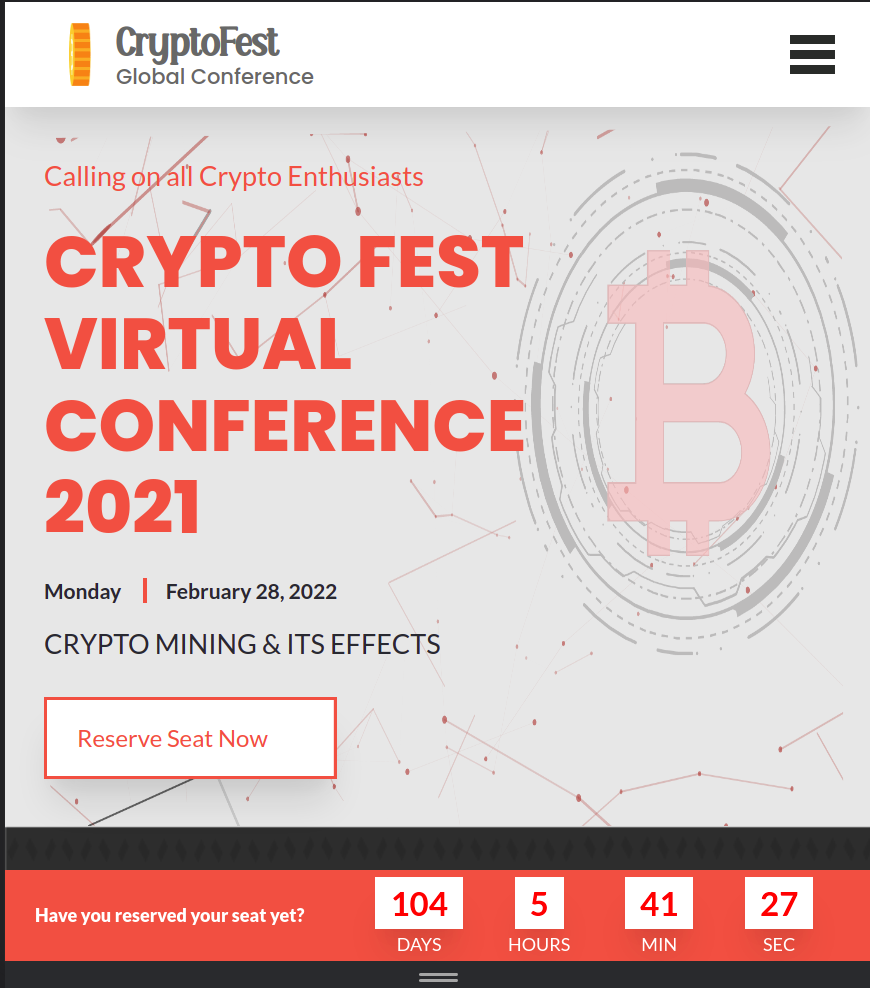
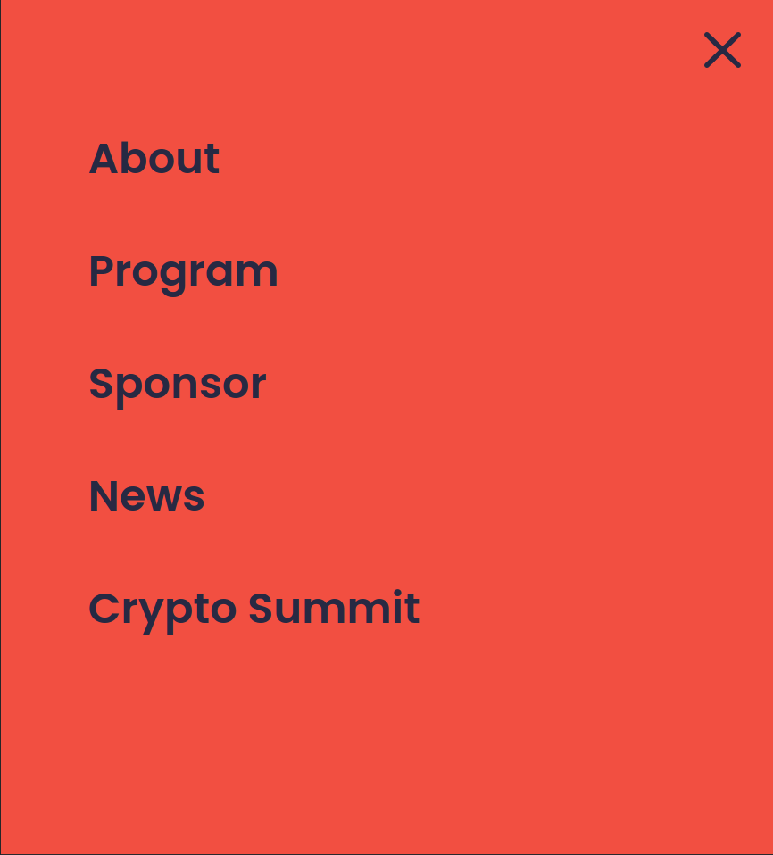
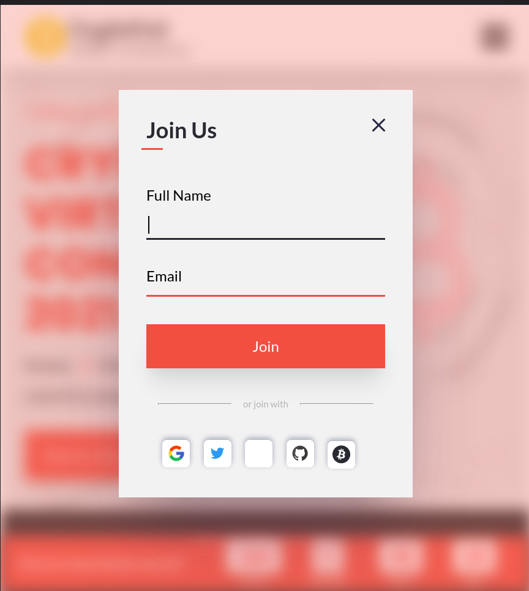
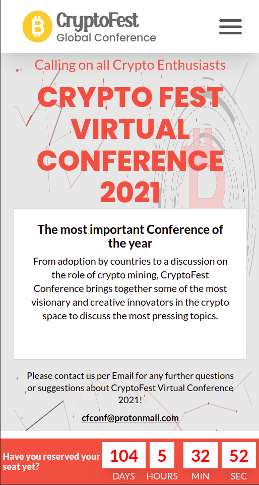

# Crypto Fest

>Complete Project Screenshots

### Mobile Page


### Hamburger menu


### Popup Form


### About Pge


Additional description about the project and its features.

## Built With

- Major languages - HTML
- CSS  Preprocessor - Sass
- Frameworks - No Frameworks Used
- Tools used - Git(version control), WebHint(linting tool), Stylelint(style linting), ESLint(Javascript linting)

## Live Demo

[View Live Demo](https://anselemodims.github.io/CryptoFest/)

## Getting Started

To get a local copy up and running follow these simple example steps.

### Prerequisites
 - A text editor(preferably Visual Studio Code)
### Install
  -  [Git](https://git-scm.com/downloads)
  -  [Node](https://nodejs.org/en/download/)
### Usage
  - Clone the repository using  ```git clone git@github.com:AnselemOdims/CryptoFest.git```
  -  cd into the project folder
  -  Run npm install

## Authors

👤 Anselem Odimegwu

- GitHub: [github](https://github.com/AnselemOdims)
- LinkedIn: [LinkedIn](https://www.linkedin.com/in/anselem-odimegwu-65a679104/)

## 🤝 Contributing

Contributions, issues, and feature requests are welcome!

Feel free to check the [issues page](../../issues/).

## Show your support

Give a ⭐️ if you like this project!

## Acknowledgments
- Inspired by original design for Creative Commons by Cindy Shin on [Behance](https://www.behance.net/gallery/29845175/CC-Global-Summit-2015)

- [Mozilla Developer Networks](https://developer.mozilla.org/en-US/)
## 📝 License

This project is [MIT](./MIT.md) licensed.